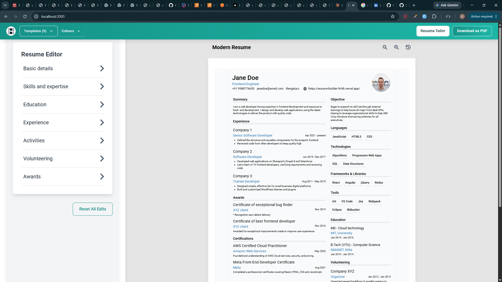

# Resume Builder

Build, customize, and download a professional resume. No sign-up, no account, nothing to install.

## What it does

- Open the site and start editing right away — no sign-in, no setup, no multi-step forms to click through.
- Edit your details in a form panel and see a live, real-time preview of your resume next to it.
- Choose from 9 resume templates and switch between them anytime without losing your data.
- Customize colors for whichever template you pick.
- Download your finished resume as a PDF, ready to send to employers.
- Your data is saved locally in your browser — nothing is uploaded or stored on a server.
- **Resume Tailor**: upload an existing resume and paste a job description to get an ATS match score, missing-keyword suggestions, and formatting feedback.

## Using it

1. Open the site — you land directly in the editor with a sample resume already filled in.
2. Replace the sample content with your own details, section by section (basics, skills, experience, education, activities, volunteering, awards, certifications).
3. Pick a template and color scheme from the top navigation.
4. Click **Download as PDF** when you're happy with it.
5. Come back anytime — your edits are remembered in your browser.
